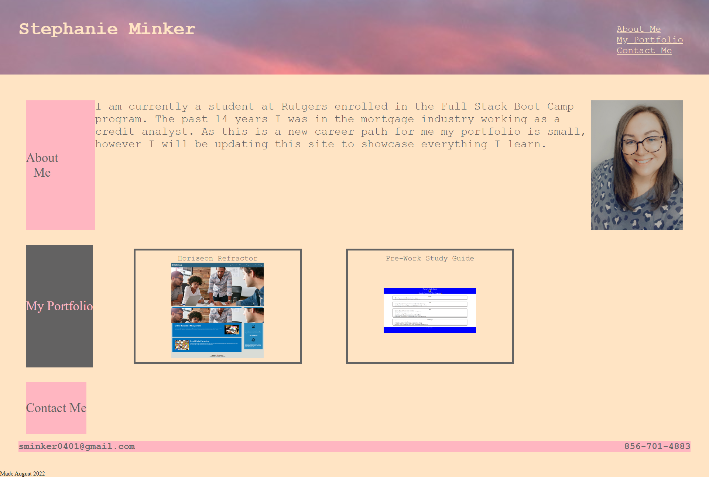
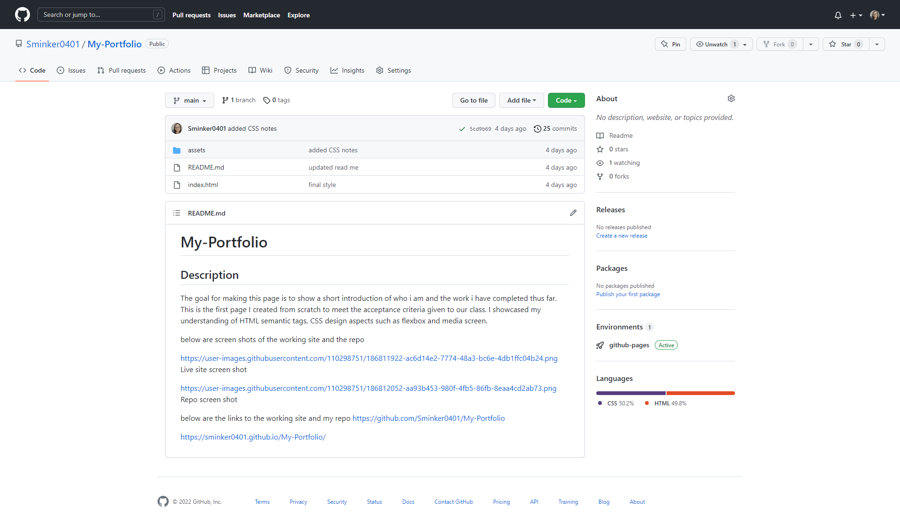

# My-Portfolio

## Description
The goal for making this page is to show a short introduction of who i am and the work i have completed thus far.
This is the first page I created from scratch to meet the acceptance criteria given to our class. 
I showcased my understanding of HTML semantic tags, CSS design aspects such as flexbox and media screen. 

below are screen shots of the working site and the repo

below are the links to the working site and my repo

https://sminker0401.github.io/My-Portfolio/

https://github.com/Sminker0401/My-Portfolio

1
